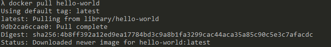
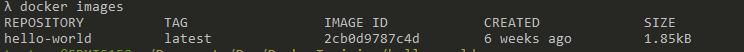
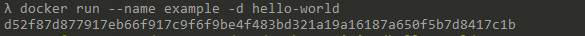
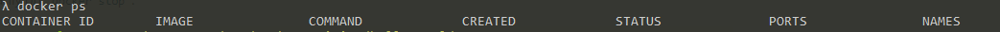
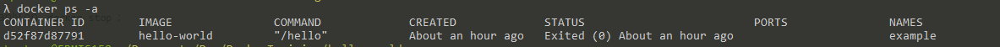
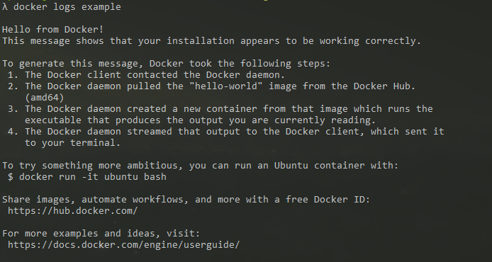
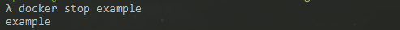

#Docker Introduction
A quick and simple introduction into the world of docker.

##Overview 
* Images
* Dockerfile
* Compose Files


## Commands
A quick over view of the commands used in docker
* pull
* images
* run
* ps
* logs
* stop

## pull
Will pull the docker image hello-world
```bash
docker pull hello-world
```


## images
View images
```bash
docker images 
```


## run
Will pull the image, create a container and start it up. The last arg is the image name 

common args
* --rm: will remove the container once it has been stopped.
* -d: will run it detached mode or in the background.
* --name: give the container a name making it easier to manage.
* -it: interactive shell such as bash, etc.
* -p: setup ports example -p 3030:8080 what this is doing is mapping the port 8080 inside the container to the port 3030 outside of the container.
* --network: assigns the container to a specific network


EXAMPLE



The long string of characters below the command is the ID of the container.

An example of the other args will be used later

## ps
common args
* -a: show all containers running and not running

This will show only the containers running

```bash
docker ps
```



#

This will show all of the containers running and stopped.

```bash
docker ps -a
```



## logs
Logs will print the the standard out from the container to the terminal
```bash
docker logs example
```


## stop
```bash
docker stop example
```


*This is not going to do much since the container stops after it runs.*

####This concludes the Introduction to docker.
