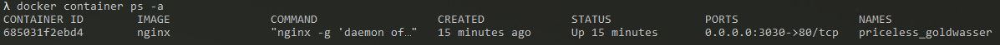
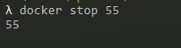

# Run Command 
This covers the different args that can be used with the run command.
## -p: exposing ports

```bash
docker run -d -p 3030:80 nginx
```
*Break Down*:
 * -d: ran it in detatched
 * -p 3030:80: 3030 is the exposed port out side container and 80 is the port inside the container. The port 80 inside the container is exposed to the outside through port 3030
 * nginx: the container image

If you didn't have the image nginx then the image will be pulled from the docker repository. Example:


using our container list command both of these command do the same thing
```bash
docker ps -a
docker container ps -a
```


When a name is not given to the container then it is given a random one like **priceless_goldwasser**

Then in a browser type in [http://localhost:3030/](http://localhost:3030/). You should be seeing this.


So lets stop the container then remove it, you can use the name or the ID of the container.
When using the ID you don't have to use the full ID just enough for it to know which container to stop.

```bash
// these do the same thing.
docker stop priceless_goldwasser // or
docker stop 685
```
By listing our containers we can see that priceless_goldwasser was stopped.


Now lets remove it.
```bash
docker rm 68
```


And if you list the containers again you should not see the container.


### Tip 
You can stop and remove multiple containers in one command.


Stop multiple


Remove  multiple


## --rm 
This will remove the container once it is stopped.
```bash
docker run -d -p 8080:80 --rm nginx 
```
then stop the container and list all containers. The one you made should be gone.do





## --name
This gives the container a name.
```bash
docker run -d --name frank nginx
```


## -it
This command connects the container to the terminal. I am using the --rm command to keep my containers clean.

```bash
docker run --rm -it ubuntu
```

You can now interact with the container and execute linux commands.


# Exec Command

